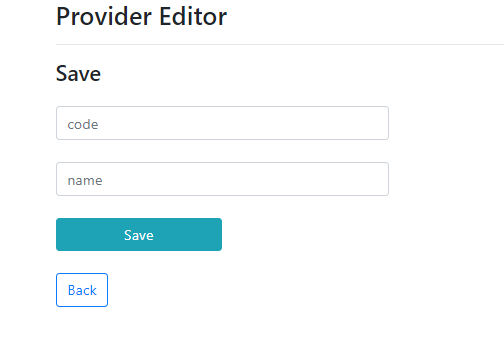

# Provider Editor
> Application that allows you track and modify supplier's arrival dates to company.

## Table of contents
* [Screenshots](#screenshots)
* [Technologies](#technologies)
* [Setup](#setup)
* [Status](#status)

## Screenshots

## Technologies
* Java - version 1.8
* Spring - version 5.1.9.RELEASE
* Hibernate - version 5.3.10.Final
* Thymeleaf - version 3.0.11.RELEASE
* HTML - version 5
* CSS - version 3
* Bootstrap - version 4.3.1
* JQuery - version 2.1.1
* Maven - version 4.0.0
* MySQL Workbench 8.0.17

## Setup
1. Download ProviderEditor.jar
2. Load DB in MySQL(scripts are in this repo). You can find URL, user and password in properties file.
3. Run ProviderEditor.jar
4. Go to your browser and type: http://localhost:8080

## Status
Project is in progress.
