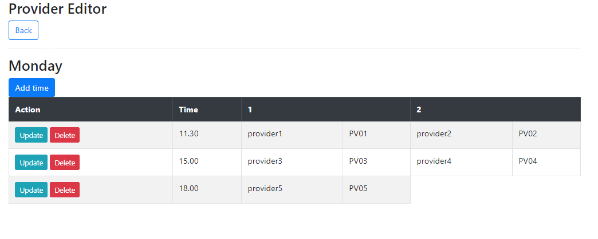
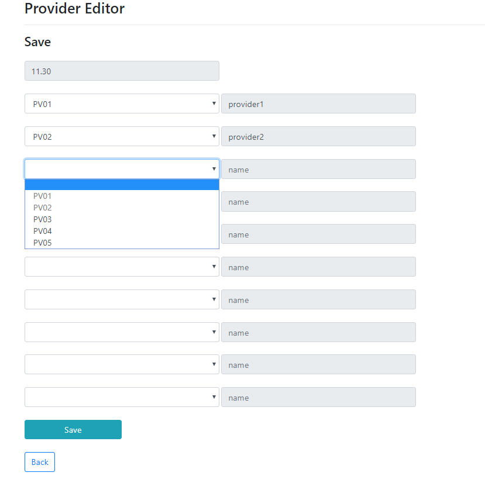

# Provider Editor
> Application that allows you track and modify supplier's arrival dates to company.

## Table of contents
* [General info](#general-info)
* [Screenshots](#screenshots)
* [Technologies](#technologies)
* [Setup](#setup)
* [Status](#status)

## General info

## Screenshots

## Technologies
* Java - version 1.8
* Spring - version 5.1.9.RELEASE
* Hibernate - version 5.3.10.Final
* Thymeleaf - version 3.0.11.RELEASE
* HTML - version 5
* CSS - version 3
* Bootstrap - version 4.3.1
* JQuery - version 2.1.1
* Maven - version 4.0.0
* MySQL Workbench 8.0.17

## Setup
1. Download ProviderEditor.jar
2. Run it
3. Go to your browser and type: http://localhost:8080

## Status
Project is in progress.
